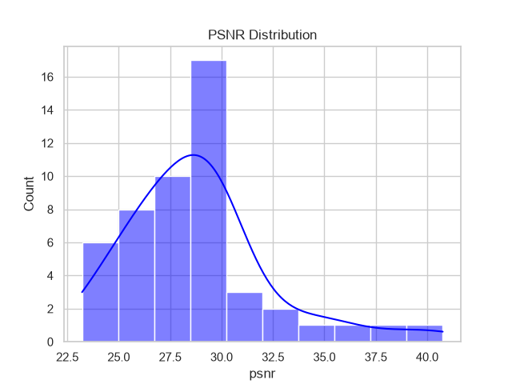
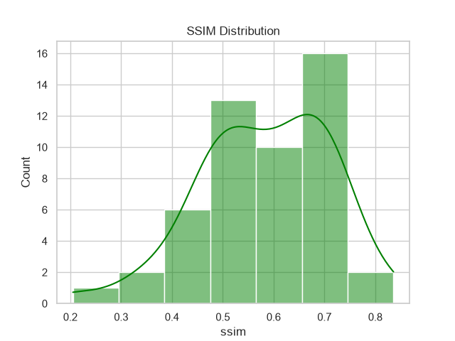
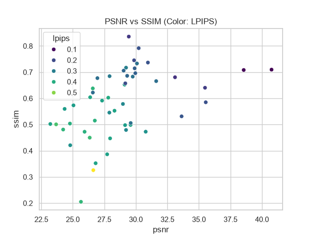

# Model Evaluation Report
        
## Overview
- **Project:** InfraVision AI
- **Model Used:** Pix2Pix (U-Net Generator + PatchGAN Discriminator)
- **Dataset:** Landsat 8 (Thermal IR to RGB)
- **Images Evaluated:** 50
- **Hardware:** GPU

## Average Metrics
| Metric | Score | Description |
|---|---|---|
| **PSNR** | 28.83 dB | Peak Signal-to-Noise Ratio (Higher is better) |
| **SSIM** | 0.5825 | Structural Similarity Index (Closer to 1 is better) |
| **LPIPS** | 0.3135 | Learned Perceptual Image Patch Similarity (Lower is better) |
| **FID** | 132.92 | Fréchet Inception Distance (Lower is better) |
| **MSE** | 0.0017 | Mean Squared Error |
| **MAE** | 0.0281 | Mean Absolute Error |

## Performance
| Metric | Time |
|---|---|
| **Average Inference Time** | 14.37 ms |
| **Min Inference Time** | 4.00 ms |
| **Max Inference Time** | 343.08 ms |
| **Frames Per Second (FPS)** | 69.6 |

## Figures
- 
- 
- 

## Future Improvements
- Train on larger batch sizes to improve FID.
- Introduce Attention mechanisms in the U-Net.
